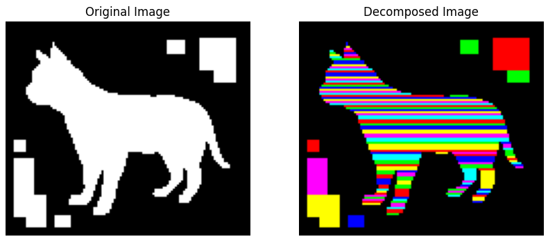
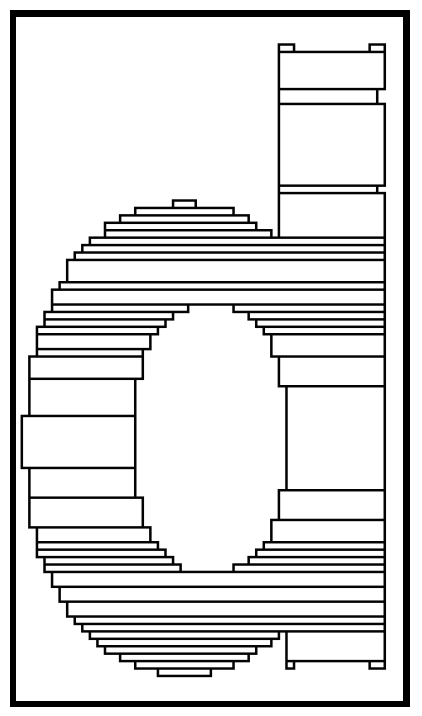

# `mosaic`

`mosaic` is a Python library for performing rectangular decomposition of 2D binary images using the Generalized Delta-method (GDM) technique. This technique, proposed by Spiliotis and Mertzios in their paper ["Real-time computation of two-dimensional moments on binary images using image block representation"](https://ieeexplore.ieee.org/document/725368), allows for efficient identification and grouping of contiguous foreground regions into rectangular blocks.

<div align="center">
  
</div>

Further research and comparisons conducted by Suk et al. in their paper ["Rectangular Decomposition of Binary Images"](https://library.utia.cas.cz/separaty/2012/ZOI/suk-rectangular%20decomposition%20of%20binary%20images.pdf) have underscored the exceptional efficiency of the GDM technique. Their studies, which benchmarked various methods for binary image decomposition, concluded that the approach adopted by Spiliotis and Mertzios stands out for its optimal balance between computational speed and the quality of results. This makes this repository not only a powerful tool for image analysis tasks but also the preferred choice for applications demanding high performance and accuracy.

## How the Algorithm Works


The GDM technique utilizes a step-by-step process to decompose 2D binary images into rectangular blocks. Here's a breakdown of how the algorithm operates: 

**Step 1: Identifying Object Level Intervals**  
For each line `y` in the image, the algorithm identifies intervals of contiguous foreground pixels, referred to as "object level intervals."

**Step 2: Comparing Intervals with Previous Blocks**  
The algorithm then compares these intervals to existing blocks that were identified up to the previous line (`y - 1`). This step determines if an interval is part of an existing block or if it marks the start of a new block.

**Step 3: Initiating New Blocks**  
If an interval does not align with any existing block, it signifies the start of a new block. This new block is initialized based on the interval's position.

**Step 4: Extending Existing Blocks**  
When an interval matches with an existing block, the algorithm extends the block to include the new interval, marking the block's end at line `y`.

This iterative process allows this algorithm to efficiently group contiguous foreground regions into rectangular blocks, optimizing both the speed and accuracy of binary image decomposition.


## Installation

You can install Mosaic using pip:

```
pip install git+https://github.com/thomashirtz/mosaic#egg=mosaic
```

## Quick Start

Get started with just a few lines of code. This simple example demonstrates how to perform rectangular decomposition on a binary image:

```python
from mosaic import rectangular_decomposition
import numpy as np

# Example binary image (replace with your own)
image = np.random.randint(2, size=(100, 100), dtype=bool)
rectangles = rectangular_decomposition(image)

print("Identified rectangles:", rectangles)
```

To see `mosaic` in action, including how to use the visualization functionality, check out the [example script](scripts/example.py). This script guides you through reading a binary image, performing decomposition, and visualizing the results.

## Usage

### Single Image Decomposition
To perform rectangular decomposition on a single binary image, you can use the `rectangular_decomposition` function:

```python
from mosaic import rectangular_decomposition

image = ...  # Your binary image as a 2D NumPy array
rectangles = rectangular_decomposition(image)
```

This function returns a list of Rectangle, where each tuple represents a rectangular block identified within the image.

### Batch Processing
Mosaic also provides a function for processing a batch of binary images:

```python
from mosaic import batch_rectangular_decomposition

image_batch = ...  # Your batch of binary images
batch_results = batch_rectangular_decomposition(image_batch)
```

This function accepts a batch of binary images as input and returns a list of lists, where each inner list contains Rectangle namedtuples for the corresponding image in the batch.

### Visualizing Results

Visualize the decomposition of an image to better understand the process and results of the `mosaic` library. This functionality not only aids in verifying the effectiveness of the rectangular decomposition but also provides insightful visual feedback that can be used for presentations or further analysis.

```python
from mosaic.utilities import plot_image_decomposition

# Assuming 'binary_image' and 'rectangle_list' are already defined
plot_image_decomposition(binary_image, rectangle_list)
```

Leverage this visualization tool to explore how different binary images are decomposed into rectangular blocks. This can be particularly useful for understanding the library's behavior on complex images, thereby enhancing your overall image processing workflow.

## License

     Copyright 2024 Thomas Hirtz

     Licensed under the Apache License, Version 2.0 (the "License");
     you may not use this file except in compliance with the License.
     You may obtain a copy of the License at

         http://www.apache.org/licenses/LICENSE-2.0

     Unless required by applicable law or agreed to in writing, software
     distributed under the License is distributed on an "AS IS" BASIS,
     WITHOUT WARRANTIES OR CONDITIONS OF ANY KIND, either express or implied.
     See the License for the specific language governing permissions and
     limitations under the License.
