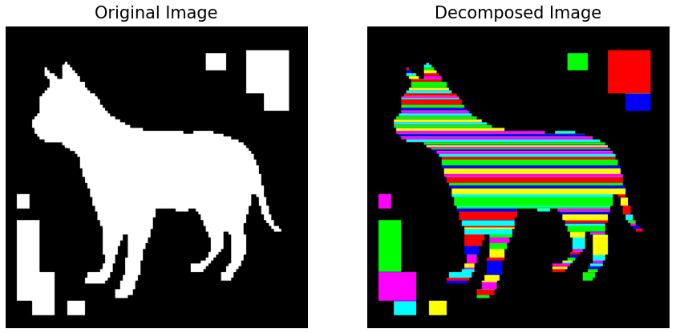

# `mosaic`

`mosaic` is a Python library for performing rectangular decomposition of 2D binary images using the Generalized Delta-method (GDM) technique. This technique, proposed by Spiliotis and Mertzios in their paper ["Real-time computation of two-dimensional moments on binary images using image block representation"](https://ieeexplore.ieee.org/document/725368), allows for efficient identification and grouping of contiguous foreground regions into rectangular blocks.

<div align="center">
  
</div>

## Installation

You can install Mosaic using pip:

```
pip install git+https://github.com/thomashirtz/mosaic#egg=mosaic
```

## Quick Start

Get started with just a few lines of code. This simple example demonstrates how to perform rectangular decomposition on a binary image:

```python
from mosaic import rectangular_decomposition
import numpy as np

# Example binary image (replace with your own)
image = np.random.randint(2, size=(100, 100), dtype=bool)
rectangles = rectangular_decomposition(image)

print("Identified rectangles:", rectangles)
```

To see `mosaic` in action, including how to use the visualization functionality, check out the [example script](scripts/example.py). This script guides you through reading a binary image, performing decomposition, and visualizing the results.

## Usage

### Single Image Decomposition
To perform rectangular decomposition on a single binary image, you can use the `rectangular_decomposition` function:

```python
from mosaic import rectangular_decomposition

image = ...  # Your binary image as a 2D NumPy array
rectangles = rectangular_decomposition(image)
```

This function returns a list of Rectangle, where each tuple represents a rectangular block identified within the image.

### Batch Processing
Mosaic also provides a function for processing a batch of binary images:

```python
from mosaic import batch_rectangular_decomposition

image_batch = ...  # Your batch of binary images
batch_results = batch_rectangular_decomposition(image_batch)
```

This function accepts a batch of binary images as input and returns a list of lists, where each inner list contains Rectangle namedtuples for the corresponding image in the batch.

### Visualizing Results
Visualize the decomposition of an image:

```python
from mosaic.utilities import plot_image_decomposition

# Assuming 'image' and 'rectangles' are already defined
plot_image_decomposition(binary_image, rectangle_list)
```

## License

     Copyright 2024 Thomas Hirtz

     Licensed under the Apache License, Version 2.0 (the "License");
     you may not use this file except in compliance with the License.
     You may obtain a copy of the License at

         http://www.apache.org/licenses/LICENSE-2.0

     Unless required by applicable law or agreed to in writing, software
     distributed under the License is distributed on an "AS IS" BASIS,
     WITHOUT WARRANTIES OR CONDITIONS OF ANY KIND, either express or implied.
     See the License for the specific language governing permissions and
     limitations under the License.
